<!-- BACK TO TOP ANCHOR -->

<a id="readme-top"></a>

<!-- LOGO -->
<div align="center">
  <a href="https://leonardo-vasconcellos.vercel.app/portfolio/easy-clinic">
    
  </a>

  <h1 align="center">Easy Clinic (Clínica Fácil)</h1>

  <p align="center">A full-featured medical clinic management system covering patient records, appointment scheduling, prescriptions, exam tracking, and billing analytics — built for Brazilian healthcare practices.</p>

  <p align="center">// clinic management system · clínica fácil</p>

  <br />

<a href="https://leonardo-vasconcellos.vercel.app/portfolio/easy-clinic"><strong>View it live »</strong></a>

</div>

<br />

<!-- SHIELDS -->
<div align="center">

[![Creator Website][website-shield]][website-url]
[![Contributors][contributors-shield]][contributors-url]
[![Forks][forks-shield]][forks-url]
[![Issues][issues-shield]][issues-url]
[![LinkedIn][linkedin-shield]][linkedin-url]
[![Released][year-shield]][year-url]

</div>

<!-- TABLE OF CONTENTS -->
<details>
  <summary>Table of Contents</summary>
  <ol>
    <li><a href="#about-the-project">About The Project</a></li>
    <li><a href="#features">Features</a></li>
    <li><a href="#free-vs-paid">Free vs. Paid Edition</a></li>
    <li><a href="#screenshots">Screenshots</a></li>
    <li><a href="#built-with">Built With</a></li>
    <li><a href="#getting-started">Getting Started</a></li>
    <li><a href="#roadmap">Roadmap</a></li>
    <li><a href="#contributors">Contributors</a></li>
    <li><a href="#contact">Contact</a></li>
  </ol>
</details>

<!-- ABOUT THE PROJECT -->

## About The Project

[![Product Screenshot][product-screenshot]](https://leonardo-vasconcellos.vercel.app/portfolio/easy-clinic)

<!-- PROJECT INTRO: 260 chars max -->

Easy Clinic is a complete medical clinic management platform — patient records, scheduling, prescriptions, lab exams, and billing analytics in one system — available as a real-time multi-user Meteor app or a zero-backend PWA for solo practitioners.

<!-- END INTRO -->

Easy Clinic is a complete clinic management platform developed for Brazilian medical practices. It covers every operational dimension of a small-to-medium clinic: patient registration with photo and CPF validation, a FullCalendar-based appointment scheduler with drag-and-drop and multi-doctor resource views, a full patient clinical record system with a timeline of visits, and a document engine for generating prescriptions, medical certificates, and exam requests from reusable templates.

The clinical record module goes beyond simple note-taking. Doctors can design custom intake forms using a visual drag-and-drop form builder, order exams from a self-learning catalog that infers reference ranges from free-text entries and filters them by patient gender and age, and track patient evolution over time — BMI, weight, blood pressure, SpO₂, and heart rate — with trend charts rendered via Chart.js.

On the business side, the dashboard surfaces live KPIs (total patients, appointments this month, monthly billing) and a 12-month appointment history chart. Three dedicated report screens cover appointment volume, patient demographics (age groups, gender distribution), and production billing. Automated appointment reminders are sent by email and SMS via a background cron job.

The system ships in two editions. The **paid edition** is a full-stack reactive application: multi-user with role-based access control (super-admin, medical_doctor, default), server-side validation, real-time pub/sub data sync, and a Cordova/Android mobile build. The **free edition** (the `rip/` folder) is a zero-backend PWA that runs entirely in the browser — all collections are loaded from flat JSON files into an in-memory store, with optional IndexedDB persistence for returning users. It exposes the same screens and feature surface as the paid edition, making it suitable for a solo practitioner who doesn't need multi-user or real-time sync.

Built with **Meteor 1.4**, **MongoDB 3.2**, **Blaze**, and **Bootstrap 3**. Deployed via Docker. The UI is in Brazilian Portuguese with English and Spanish i18n support.

<p align="right">(<a href="#readme-top">back to top</a>)</p>

<!-- FEATURES -->

## Features

<a id="features"></a>

### Dashboard & Analytics

| Feature                   | Description                                                                                                |
| ------------------------- | ---------------------------------------------------------------------------------------------------------- |
| KPI cards                 | Total patients, appointments this month, clinical records this month, total prescriptions, monthly billing |
| Appointment history chart | 12-month bar chart of completed appointments                                                               |
| Records breakdown         | Pie chart of clinical record types (forms, prescriptions, certificates, exam requests)                     |
| Age group distribution    | Bar chart of patient population by age band (0–17, 18–29, 30–44, 45–59, 60+)                               |
| Gender demographics       | Donut chart of patient gender split                                                                        |
| Today's agenda            | Scrollable list of today's scheduled appointments with quick access to patient records                     |

### Patient Management

| Feature              | Description                                                                             |
| -------------------- | --------------------------------------------------------------------------------------- |
| Patient registration | Full profile: name, CPF (with validation), date of birth, gender, address, phone, email |
| Photo capture        | Camera capture or file upload for patient profile photos                                |
| Patient list         | Searchable, sortable DataTables list with inline avatars and accent-neutralized search  |
| Age-aware context    | Patient age passed to the exam catalog for gender- and age-appropriate reference ranges |

### Clinical Records

| Feature              | Description                                                                             |
| -------------------- | --------------------------------------------------------------------------------------- |
| Patient timeline     | Chronological timeline of all encounters; expandable entries per visit                  |
| Custom intake forms  | Fill any form model during a consultation; results stored in the patient's record       |
| Prescriptions        | Generate prescriptions from rich-text templates; stored in the timeline                 |
| Medical certificates | Issue certificates from templates; stored in the timeline                               |
| Exam requests        | Order lab exams from document templates; stored in the timeline                         |
| Lab exam results     | Enter measured values against a catalog of exams; altered results flagged automatically |

### Patient Evolution Tracking

| Feature           | Description                                                                                                           |
| ----------------- | --------------------------------------------------------------------------------------------------------------------- |
| BMI               | Computed from weight and height; classified (normal / overweight / obese) with delta since first visit                |
| Weight & height   | Trend over all visits                                                                                                 |
| Blood pressure    | Systolic / diastolic; classified (normal / elevated / hypertensive)                                                   |
| Heart rate & SpO₂ | Trend over all consultations                                                                                          |
| Trend charts      | Four Chart.js line charts — BMI, weight, blood pressure, heart rate & SpO₂ — displayed on the patient's Evolution tab |

### Appointment Scheduling

| Feature                    | Description                                                                                 |
| -------------------------- | ------------------------------------------------------------------------------------------- |
| Visual calendar            | Calendar Scheduler with day, week, and month views                                          |
| Multi-doctor resource view | Timeline view with one column per doctor; patient photo shown on the event                  |
| Drag & drop                | Move and resize events directly on the calendar                                             |
| Appointment statuses       | Scheduled → Waiting → Attending → Finished / No-show; color-coded                           |
| Quick patient creation     | Create a new patient from within the scheduling form without leaving the calendar           |
| Configurable slots         | Admin sets the appointment duration per doctor                                              |
| Automated reminders        | Cron job fires every 30 minutes; sends email and SMS to patients with upcoming appointments |

### Document & Form Engine

| Feature                | Description                                                                                        |
| ---------------------- | -------------------------------------------------------------------------------------------------- |
| Document model editor  | SummerNote rich-text editor with variable interpolation (patient name, date, doctor, etc.)         |
| Prescription templates | Reusable prescription layouts; selected at consultation time                                       |
| Certificate templates  | Medical certificate templates with free-text and structured fields                                 |
| Exam request templates | Templates for lab or imaging referrals                                                             |
| Form model designer    | Drag-and-drop form builder (form-builder.js); supports text, select, checkbox, date, and more      |
| Custom form rendering  | Built forms render inside the consultation modal and their data is persisted to the patient record |

### Exam Catalog

| Feature                | Description                                                                                                                                                         |
| ---------------------- | ------------------------------------------------------------------------------------------------------------------------------------------------------------------- |
| Searchable catalog     | Autocomplete search across hundreds of lab exams                                                                                                                    |
| Smart reference ranges | Reference values filterable by patient gender and age group                                                                                                         |
| Machine learning       | When a doctor enters a free-text reference value for a new exam, the system parses it (e.g. "13–17", "até 200", "> 30") and stores a structured rule for future use |
| Usage tracking         | Exams are ranked by usage count so the most-ordered tests surface first in autocomplete                                                                             |

### Reference Catalogs

| Feature             | Description                                                                                 |
| ------------------- | ------------------------------------------------------------------------------------------- |
| Drug catalog        | Searchable medication database with offline support (ground:db)                             |
| ICD-10 browser      | Complete international disease classification; offline-capable with persistent client cache |
| Medical specialties | CRUD management of clinical specialties assigned to doctors                                 |

### Administration & Reporting

| Feature               | Description                                                                                                                      |
| --------------------- | -------------------------------------------------------------------------------------------------------------------------------- |
| Doctor profiles       | Name, specialty, photo, and configurable work-hour blocks per day                                                                |
| User management       | Create / edit users; assign roles; send enrollment email automatically                                                           |
| Role-based access     | Roles: `super-admin`, `medical_doctor`, `default`; privileged methods guarded server-side                                        |
| Clinic settings       | Set appointment value (used for billing KPI)                                                                                     |
| CSV import            | Bulk patient import via CSV (PapaParse); validation run on a staging collection before commit                                    |
| Report — Appointments | Monthly appointment counts by doctor; filterable date range                                                                      |
| Report — Patients     | Demographics: age distribution, gender breakdown, new patients over time                                                         |
| Report — Production   | Monthly billing KPI, total procedures by type (forms, prescriptions, certificates, exam requests), 12-month production bar chart |
| Multi-language        | pt-BR, English, and Spanish via tap:i18n                                                                                         |

<p align="right">(<a href="#readme-top">back to top</a>)</p>

<!-- FREE VS PAID -->

## Free vs. Paid Edition

<a id="free-vs-paid"></a>

The free edition is a static PWA — no server, no database, no install. It runs in any browser and stores data locally via IndexedDB. The paid edition (`src/`) is the full-stack Meteor application with a MongoDB backend, multi-user access, and real-time data sync.

| Feature                                |           Free PWA            |  Paid (Meteor)  |
| -------------------------------------- | :---------------------------: | :-------------: |
| **Data storage**                       |      Browser (IndexedDB)      |     MongoDB     |
| **Deployment**                         |        Static hosting         | Docker / Server |
| **Offline support**                    | ✅ Service Worker + IndexedDB |        —        |
| **Dashboard & KPIs**                   |              ✅               |       ✅        |
| **Patient management**                 |              ✅               |       ✅        |
| **Patient photo upload**               |              ✅               |       ✅        |
| **Clinical records timeline**          |              ✅               |       ✅        |
| **Prescriptions & certificates**       |              ✅               |       ✅        |
| **Exam requests**                      |              ✅               |       ✅        |
| **Lab exam results**                   |              ✅               |       ✅        |
| **Patient evolution charts**           |              ✅               |       ✅        |
| **Appointment scheduling**             |              ✅               |       ✅        |
| **Multi-doctor resource view**         |              ✅               |       ✅        |
| **Drag & drop calendar**               |              ✅               |       ✅        |
| **Document model editor**              |              ✅               |       ✅        |
| **Drag & drop form designer**          |              ✅               |       ✅        |
| **Exam catalog with smart ranges**     |              ✅               |       ✅        |
| **Drug catalog**                       |              ✅               |       ✅        |
| **ICD-10 browser**                     |              ✅               |       ✅        |
| **Reports (3 screens)**                |              ✅               |       ✅        |
| **CSV patient import**                 |              ✅               |       ✅        |
| **Multi-language (pt-BR / en / es)**   |              ✅               |       ✅        |
| **Multi-user accounts**                |        ❌ Single user         |  ✅ Unlimited   |
| **Role-based access control**          |              ❌               |       ✅        |
| **Real-time reactive data sync**       |              ❌               |       ✅        |
| **Server-side validation & security**  |              ❌               |       ✅        |
| **Automated SMS reminders**            |              ❌               |       ✅        |
| **Automated email reminders**          |              ❌               |       ✅        |
| **Mobile app (Android / Cordova)**     |              ❌               |       ✅        |
| **Audit hooks (before insert/update)** |              ❌               |       ✅        |

<p align="right">(<a href="#readme-top">back to top</a>)</p>

<!-- SCREENSHOTS -->

## Screenshots

<div align="center" style="display:flex;flex-wrap:wrap;gap:8px;justify-content:center;">
  <a href="screenshots/04 - login.png"></a>
  <a href="screenshots/02 - dashboard.png"></a>
  <a href="screenshots/03 - scheduel.png"></a>
  <a href="screenshots/rip-patient-list.png">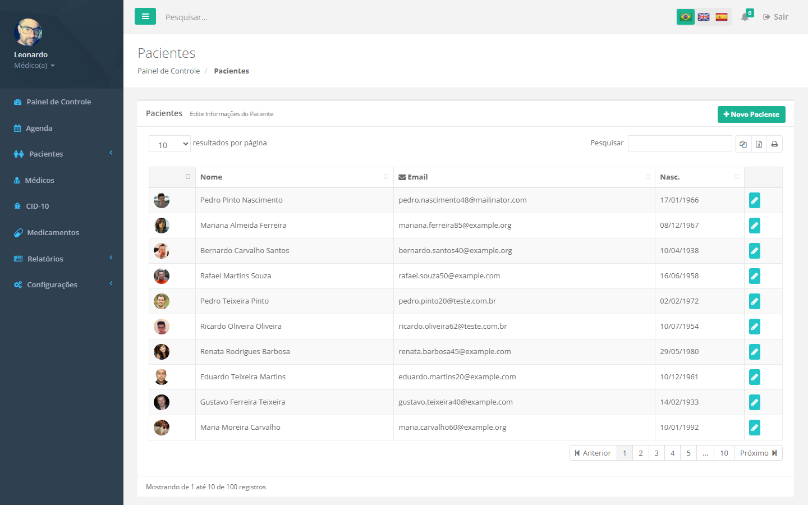</a>
  <a href="screenshots/rip-doctors.png">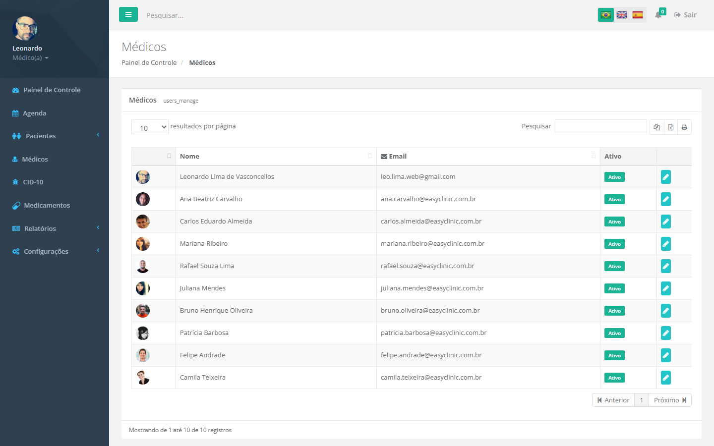</a>
  <a href="screenshots/report-patients.png">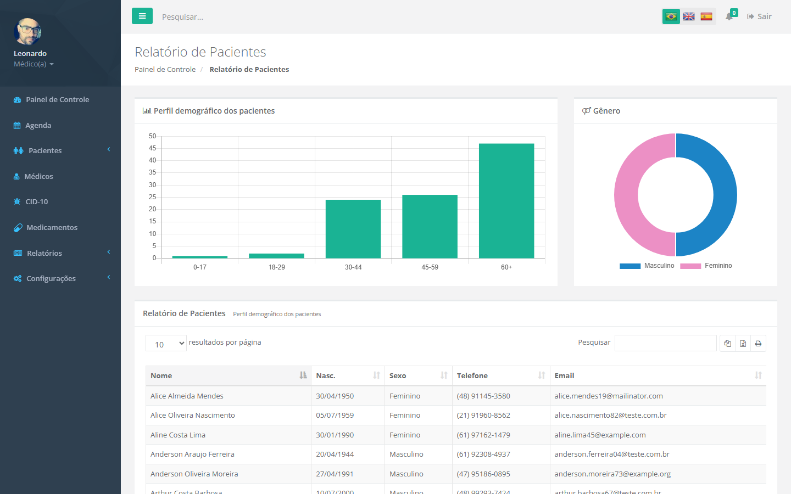</a>
  <a href="screenshots/report-production.png">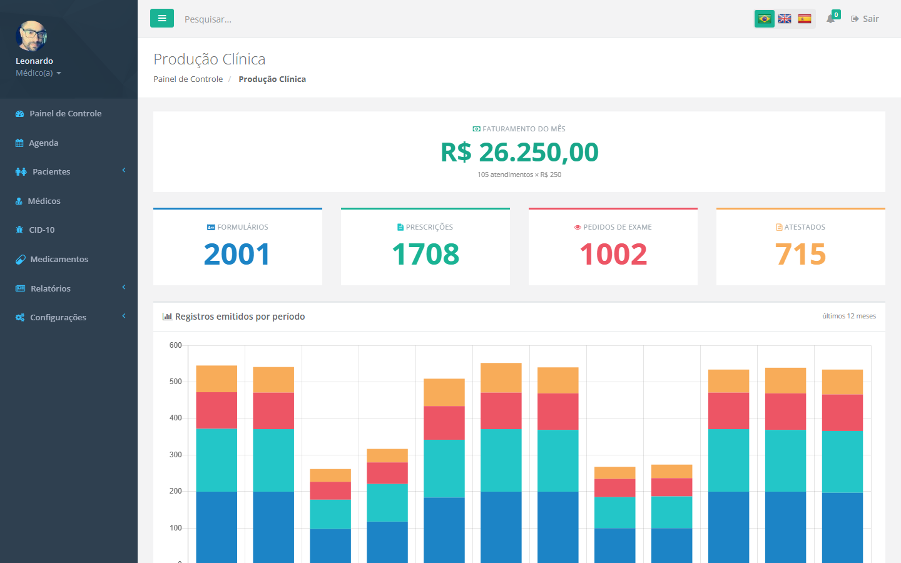</a>
  <a href="screenshots/exam-catalog.png">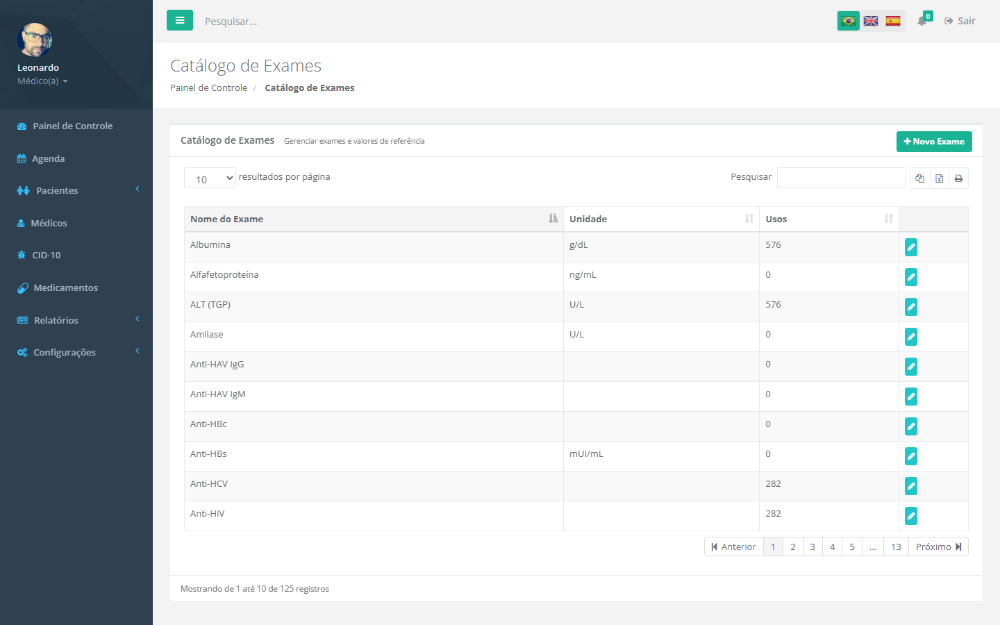</a>
  <a href="screenshots/document-models.png">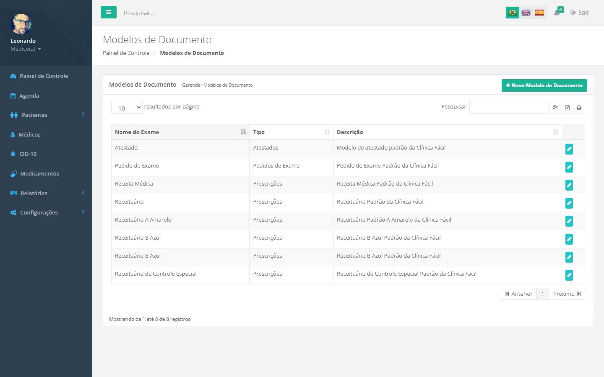</a>
  <a href="screenshots/form-models.png">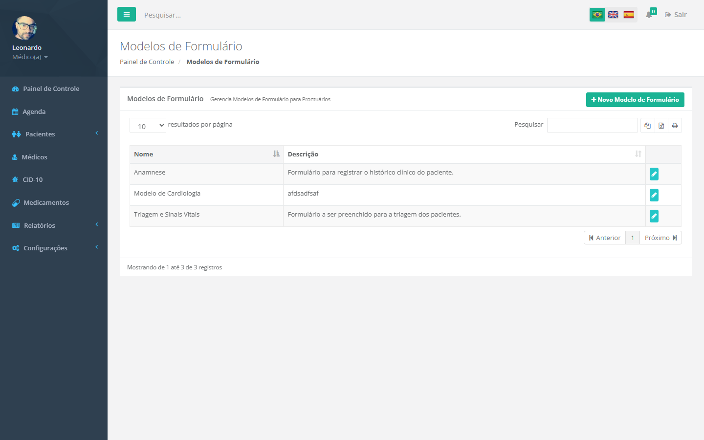</a>
  <a href="screenshots/orig-ipad.png">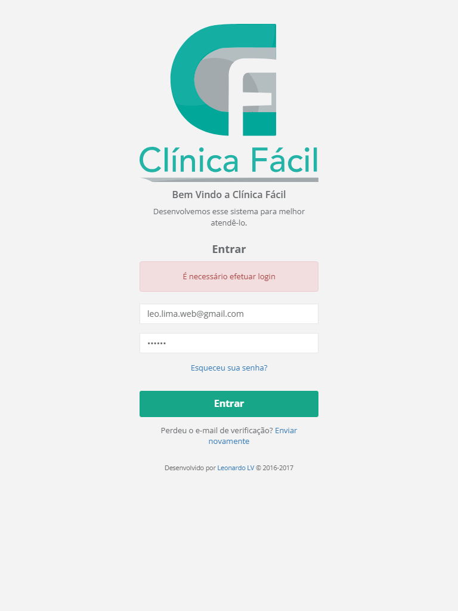</a>
  <a href="screenshots/v-patients-mobile.png">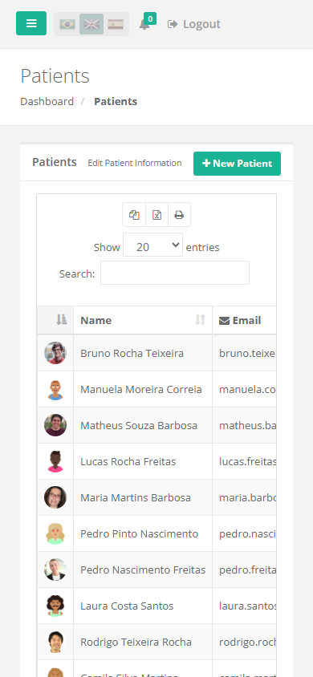</a>
  <a href="screenshots/v-patients-drawer.png">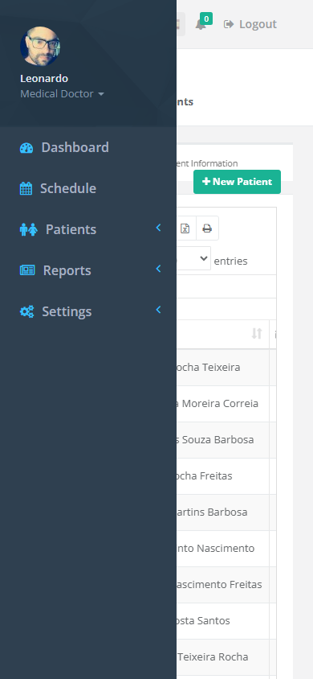</a>
  <a href="screenshots/v-schedule-mobile.png">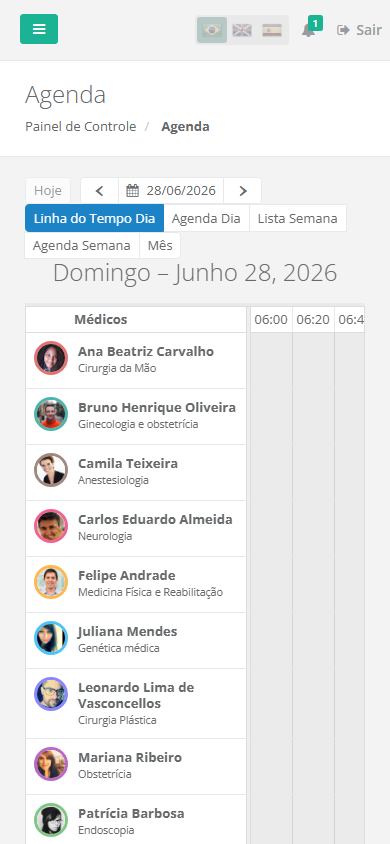</a>
  <a href="screenshots/v-mobile-open.png"></a>
  <a href="screenshots/v-patient-photos.png">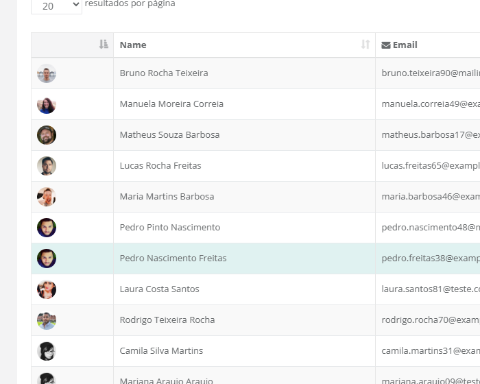</a>
  <a href="screenshots/v-drawer-submenu.png">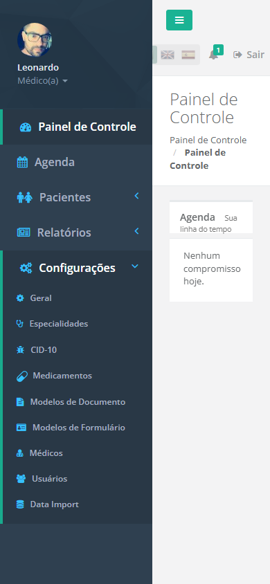</a>
  <a href="screenshots/01 - patient.png"></a>
</div>

<p align="right">(<a href="#readme-top">back to top</a>)</p>

<!-- BUILT WITH -->

## Built With

<!-- LANGUAGES -->

**Languages**

|                                                                                                                | Language   | Version      |
| -------------------------------------------------------------------------------------------------------------- | ---------- | ------------ |
|  | JavaScript | ES5 / ES2015 |
|            | HTML       | 5            |
|              | CSS / LESS | 3            |

<!-- FRAMEWORKS & LIBRARIES -->

**Frameworks & Libraries**

|                                                                                                              | Framework / Library      | Version |
| ------------------------------------------------------------------------------------------------------------ | ------------------------ | ------- |
|                                                                                                              | Meteor                   | 1.4.1.3 |
|      | MongoDB                  | 3.2     |
|  | Bootstrap                | 3.x     |
|        | jQuery                   | 1.11.x  |
|                                                                                                              | FullCalendar + Scheduler | 2.x     |
|                                                                                                              | Chart.js                 | 2.x     |
|                                                                                                              | Handlebars               | 4.0.x   |
|        | Docker                   | —       |

<p align="right">(<a href="#readme-top">back to top</a>)</p>

<!-- GETTING STARTED -->

## Getting Started

### Building for Android

#### Build the App

```sh
meteor build ../meteor-build --server https://clinicafacil.devhouse.com.br --mobile-settings mobile-config.json
```

#### Create a private key for the app

```sh
keytool -genkey -v -keystore clinica-facil.keystore -alias clinica-facil -keyalg RSA -keysize 2048 -validity 10000
```

#### Sign the app

```sh
cd ../meteor-build/android
jarsigner -verbose -sigalg SHA1withRSA -digestalg SHA1 -keystore ../../clinica-facil.keystore release-unsigned.apk clinica-facil
$ANDROID_HOME/build-tools/23.0.2/zipalign 4 release-unsigned.apk clinica-facil.apk
```

<p align="right">(<a href="#readme-top">back to top</a>)</p>

<!-- ROADMAP -->

## Roadmap

This project repository is for archive purposes only. No new features or issues are being tracked.

<p align="right">(<a href="#readme-top">back to top</a>)</p>

<!-- CONTRIBUTORS -->

## Contributors

<a href="https://github.com/llvasconcellos2/easy-clinic/graphs/contributors">
  
</a>

<p align="right">(<a href="#readme-top">back to top</a>)</p>

<!-- CONTACT -->

## Contact

[Leonardo Vasconcellos - Website](https://leonardo-vasconcellos.vercel.app/) — [LinkedIn](https://www.linkedin.com/in/llvasconcellos)

<p align="right">(<a href="#readme-top">back to top</a>)</p>

<!-- MARKDOWN LINKS & IMAGES -->

[website-shield]: https://img.shields.io/badge/Creator_Website-%E2%86%97-2eba7a?style=for-the-badge
[website-url]: https://leonardo-vasconcellos.vercel.app/
[contributors-shield]: https://img.shields.io/github/contributors/llvasconcellos2/easy-clinic.svg?style=for-the-badge
[contributors-url]: https://github.com/llvasconcellos2/easy-clinic/graphs/contributors
[forks-shield]: https://img.shields.io/github/forks/llvasconcellos2/easy-clinic.svg?style=for-the-badge
[forks-url]: https://github.com/llvasconcellos2/easy-clinic/network/members
[issues-shield]: https://img.shields.io/github/issues/llvasconcellos2/easy-clinic.svg?style=for-the-badge
[issues-url]: https://github.com/llvasconcellos2/easy-clinic/issues
[linkedin-shield]: https://img.shields.io/badge/-LinkedIn-0A66C2?style=for-the-badge&logo=linkedin&logoColor=white
[linkedin-url]: https://www.linkedin.com/in/llvasconcellos
[year-shield]: https://img.shields.io/badge/Released-2016-gray?style=for-the-badge
[year-url]: #
[product-screenshot]: screenshots/01%20-%20patient.png
